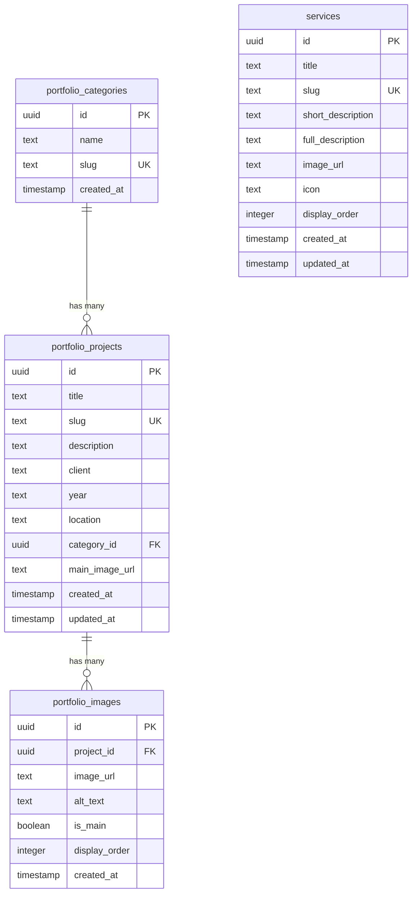

# Estrutura do Banco de Dados - Supabase

## 📊 Visão Geral

O banco de dados utiliza PostgreSQL via Supabase com 4 tabelas principais para gerenciar serviços e portfólio da Construtora Lytorânea.

## 🏗️ Schema Completo

### Tabela: `services`

Armazena informações sobre os serviços oferecidos pela construtora.

```sql
CREATE TABLE public.services (
  id UUID NOT NULL DEFAULT gen_random_uuid() PRIMARY KEY,
  title TEXT NOT NULL,
  slug TEXT NOT NULL UNIQUE,
  short_description TEXT NOT NULL,
  full_description TEXT,
  image_url TEXT,
  icon TEXT,
  display_order INTEGER NOT NULL DEFAULT 0,
  created_at TIMESTAMP WITH TIME ZONE NOT NULL DEFAULT now(),
  updated_at TIMESTAMP WITH TIME ZONE NOT NULL DEFAULT now()
);
```

**Campos:**
- `id`: Identificador único (UUID)
- `title`: Nome do serviço (ex: "Drenagem Urbana")
- `slug`: URL amigável (ex: "drenagem-urbana")
- `short_description`: Descrição resumida para cards
- `full_description`: Descrição completa para página de detalhes
- `image_url`: URL da imagem no Supabase Storage
- `icon`: Nome do ícone Lucide React
- `display_order`: Ordem de exibição (0 = primeiro)
- `created_at/updated_at`: Timestamps automáticos

### Tabela: `portfolio_categories`

Categorias para organizar projetos do portfólio.

```sql
CREATE TABLE public.portfolio_categories (
  id UUID NOT NULL DEFAULT gen_random_uuid() PRIMARY KEY,
  name TEXT NOT NULL,
  slug TEXT NOT NULL UNIQUE,
  created_at TIMESTAMP WITH TIME ZONE NOT NULL DEFAULT now()
);
```

**Campos:**
- `id`: Identificador único (UUID)
- `name`: Nome da categoria (ex: "Obras Rodoviárias")
- `slug`: URL amigável (ex: "obras-rodoviarias")
- `created_at`: Timestamp de criação

### Tabela: `portfolio_projects`

Projetos realizados pela construtora.

```sql
CREATE TABLE public.portfolio_projects (
  id UUID NOT NULL DEFAULT gen_random_uuid() PRIMARY KEY,
  title TEXT NOT NULL,
  slug TEXT NOT NULL UNIQUE,
  description TEXT,
  client TEXT,
  year TEXT NOT NULL,
  location TEXT NOT NULL,
  category_id UUID NOT NULL REFERENCES portfolio_categories(id),
  main_image_url TEXT,
  created_at TIMESTAMP WITH TIME ZONE NOT NULL DEFAULT now(),
  updated_at TIMESTAMP WITH TIME ZONE NOT NULL DEFAULT now()
);
```

**Campos:**
- `id`: Identificador único (UUID)
- `title`: Nome do projeto
- `slug`: URL amigável
- `description`: Descrição detalhada do projeto
- `client`: Nome do cliente/contratante
- `year`: Ano de realização
- `location`: Local da obra
- `category_id`: Referência para categoria (FK)
- `main_image_url`: Imagem principal do projeto
- `created_at/updated_at`: Timestamps automáticos

### Tabela: `portfolio_images`

Galeria de imagens para cada projeto.

```sql
CREATE TABLE public.portfolio_images (
  id UUID NOT NULL DEFAULT gen_random_uuid() PRIMARY KEY,
  project_id UUID NOT NULL REFERENCES portfolio_projects(id) ON DELETE CASCADE,
  image_url TEXT NOT NULL,
  alt_text TEXT,
  is_main BOOLEAN DEFAULT false,
  display_order INTEGER DEFAULT 0,
  created_at TIMESTAMP WITH TIME ZONE NOT NULL DEFAULT now()
);
```

**Campos:**
- `id`: Identificador único (UUID)
- `project_id`: Referência para projeto (FK)
- `image_url`: URL da imagem no Supabase Storage
- `alt_text`: Texto alternativo para acessibilidade
- `is_main`: Se é a imagem principal do projeto
- `display_order`: Ordem de exibição na galeria
- `created_at`: Timestamp de criação

## 🔗 Relacionamentos



## 🔐 Row Level Security (RLS)

Todas as tabelas possuem RLS habilitado com políticas de leitura pública:

```sql
-- Services
ALTER TABLE public.services ENABLE ROW LEVEL SECURITY;
CREATE POLICY "Services are publicly readable" 
ON public.services FOR SELECT 
USING (true);

-- Portfolio Categories
ALTER TABLE public.portfolio_categories ENABLE ROW LEVEL SECURITY;
CREATE POLICY "Portfolio categories are publicly readable" 
ON public.portfolio_categories FOR SELECT 
USING (true);

-- Portfolio Projects
ALTER TABLE public.portfolio_projects ENABLE ROW LEVEL SECURITY;
CREATE POLICY "Portfolio projects are publicly readable" 
ON public.portfolio_projects FOR SELECT 
USING (true);

-- Portfolio Images
ALTER TABLE public.portfolio_images ENABLE ROW LEVEL SECURITY;
CREATE POLICY "Portfolio images are publicly readable" 
ON public.portfolio_images FOR SELECT 
USING (true);
```

## 📁 Storage Buckets

### Bucket: `services`
- **Público:** Sim
- **Finalidade:** Imagens dos serviços
- **Estrutura:** `services/{service-slug}/image.jpg`

### Bucket: `portfolio`
- **Público:** Sim  
- **Finalidade:** Imagens dos projetos
- **Estrutura:** `portfolio/{project-slug}/{image-name}.jpg`

```sql
-- Criação dos buckets
INSERT INTO storage.buckets (id, name, public) 
VALUES 
  ('services', 'services', true),
  ('portfolio', 'portfolio', true);
```

## 🔧 Triggers e Funções

### Função para atualizar `updated_at`

```sql
CREATE OR REPLACE FUNCTION public.update_updated_at_column()
RETURNS TRIGGER AS $$
BEGIN
  NEW.updated_at = now();
  RETURN NEW;
END;
$$ LANGUAGE plpgsql;
```

### Triggers automáticos

```sql
-- Services
CREATE TRIGGER update_services_updated_at
  BEFORE UPDATE ON public.services
  FOR EACH ROW
  EXECUTE FUNCTION public.update_updated_at_column();

-- Portfolio Projects
CREATE TRIGGER update_portfolio_projects_updated_at
  BEFORE UPDATE ON public.portfolio_projects
  FOR EACH ROW
  EXECUTE FUNCTION public.update_updated_at_column();
```

## 📋 Consultas Úteis

### Buscar todos os serviços ordenados

```sql
SELECT id, title, slug, short_description, image_url, icon, display_order
FROM public.services 
ORDER BY display_order ASC, title ASC;
```

### Buscar serviço específico por slug

```sql
SELECT * FROM public.services 
WHERE slug = 'drenagem-urbana';
```

### Buscar projetos com categoria

```sql
SELECT 
  p.id,
  p.title,
  p.slug,
  p.description,
  p.client,
  p.year,
  p.location,
  p.main_image_url,
  c.name as category_name,
  c.slug as category_slug
FROM public.portfolio_projects p
JOIN public.portfolio_categories c ON p.category_id = c.id
ORDER BY p.year DESC, p.title ASC;
```

### Buscar projeto com imagens

```sql
SELECT 
  p.*,
  c.name as category_name,
  COALESCE(
    json_agg(
      json_build_object(
        'id', i.id,
        'image_url', i.image_url,
        'alt_text', i.alt_text,
        'is_main', i.is_main,
        'display_order', i.display_order
      ) ORDER BY i.display_order ASC
    ) FILTER (WHERE i.id IS NOT NULL), 
    '[]'
  ) as images
FROM public.portfolio_projects p
LEFT JOIN public.portfolio_categories c ON p.category_id = c.id
LEFT JOIN public.portfolio_images i ON p.id = i.project_id
WHERE p.slug = 'projeto-exemplo'
GROUP BY p.id, c.name;
```

### Buscar categorias com contagem de projetos

```sql
SELECT 
  c.id,
  c.name,
  c.slug,
  COUNT(p.id) as project_count
FROM public.portfolio_categories c
LEFT JOIN public.portfolio_projects p ON c.id = p.category_id
GROUP BY c.id, c.name, c.slug
ORDER BY c.name ASC;
```

## 🎯 Índices Recomendados

```sql
-- Índices para performance
CREATE INDEX IF NOT EXISTS idx_services_display_order ON public.services(display_order);
CREATE INDEX IF NOT EXISTS idx_services_slug ON public.services(slug);
CREATE INDEX IF NOT EXISTS idx_portfolio_projects_category ON public.portfolio_projects(category_id);
CREATE INDEX IF NOT EXISTS idx_portfolio_projects_slug ON public.portfolio_projects(slug);
CREATE INDEX IF NOT EXISTS idx_portfolio_images_project ON public.portfolio_images(project_id);
CREATE INDEX IF NOT EXISTS idx_portfolio_images_display ON public.portfolio_images(display_order);
```

## 🔄 Backup e Migração

### Backup Manual
```sql
-- Backup completo das tabelas
COPY public.services TO '/backup/services.csv' DELIMITER ',' CSV HEADER;
COPY public.portfolio_categories TO '/backup/categories.csv' DELIMITER ',' CSV HEADER;
COPY public.portfolio_projects TO '/backup/projects.csv' DELIMITER ',' CSV HEADER;
COPY public.portfolio_images TO '/backup/images.csv' DELIMITER ',' CSV HEADER;
```

### Migração de Dados
O Supabase mantém backups automáticos e permite restauração point-in-time via dashboard.

## 📊 Monitoramento

### Queries de Monitoramento

```sql
-- Verificar tamanho das tabelas
SELECT 
  schemaname,
  tablename,
  attname,
  n_distinct,
  correlation
FROM pg_stats 
WHERE schemaname = 'public';

-- Verificar performance de queries
SELECT query, calls, total_time, mean_time 
FROM pg_stat_statements 
ORDER BY total_time DESC 
LIMIT 10;
```

### Links Úteis
- **SQL Editor:** [https://supabase.com/dashboard/project/vitxtbotmtxfytusptbf/sql/new](https://supabase.com/dashboard/project/vitxtbotmtxfytusptbf/sql/new)
- **Database Dashboard:** [https://supabase.com/dashboard/project/vitxtbotmtxfytusptbf](https://supabase.com/dashboard/project/vitxtbotmtxfytusptbf)
- **Storage:** [https://supabase.com/dashboard/project/vitxtbotmtxfytusptbf/storage/buckets](https://supabase.com/dashboard/project/vitxtbotmtxfytusptbf/storage/buckets)